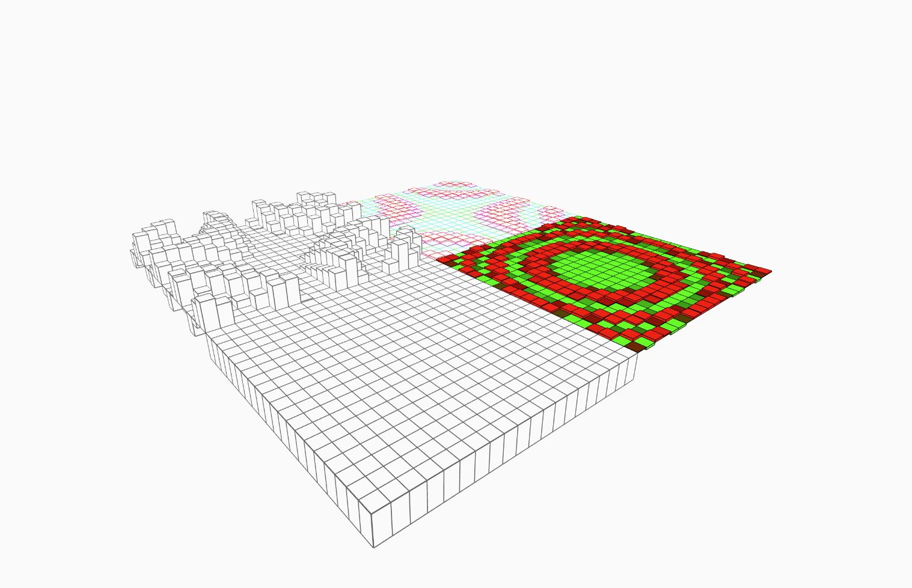

## initBasicFunctionGround
生成地面
#### 一些特性
- [ ] 可碰撞实体
- [ ] HUD显示检测区
- [x] 指定运动函数
- [x] 指定绘制方式[stroke,fill,strokeWeight]
#### 长啥样

#### 必须指定的值
暂无
#### 可以指定的值
|属性名|属性值|
|---|---|
|xsize|x方向边长|
|xcount|x方向的切分数量|
|zsize|z方向边长|
|zcount|z方向的切分数量|
|centerX|x方向中心点位置|
|centerZ|z方向中心点位置|
|f|对象的动画函数|
|stroke|同Processing|
|strokeWeight|同Processing|
|fill|同Processing|
|plRatiox|x方向缩放比例|
|plRatioz|z方向缩放比例|
#### 无法指定但是可以后台修改的值
暂无
#### TS规范
```typescript
/**
 * 生成2D函数式地板
 * @param {number} xsize x方向边长
 * @param {number} xcount x方向的切分数量
 * @param {number} zsize z方向边长
 * @param {number} zcount z方向的切分数量
 * @param {number} centerX x方向中心点位置
 * @param {number} centerZ z方向中心点位置
 * @param {(t:number,obj:object)=>void|null} f 动效函数，obj是自身this
 * @param {Array<number>|null} stroke P5-stroke值
 * @param {number} strokeWeight P5-strokeWeight值
 * @param {Array<number>|null} fill P5-fill值
 * @param {number} plRatiox x方向缩放比例
 * @param {number} plRatioz z方向缩放比例
 */
```
#### 创建
```javascript
initBasicFunctionGround();
```
```javascript
initBasicFunctionGround(1000,20,1000,20,500,500);
```
```javascript
initBasicFunctionGround(
    1000,20,1000,20,
    500,-500,
    (t,self)=>{
        let x=self.paraList.x;
        let z=self.paraList.z;
        let y=sin(x*z/100-t/100)*50+10;
        self.position.y=y;
        self.size.y=y*2
    }
);
```
```javascript
initBasicFunctionGround(
    1000,20,1000,20,
    -500,-500,
    (t,self)=>{
        let x=self.paraList.x;
        let z=self.paraList.z;
        let y=sin(x*z/100-t/100)*5;
        self.position.y=y;
        self.size.y=y*2
        self.stroke=[map(y,-1,1,0,255),map(y,-1,1,255,0),sin(y)*120+120];
    },
    [0],2,[250],
);
```
```javascript
initBasicFunctionGround(
    1000,20,1000,20,
    -500,500,
    (t,self)=>{
        let x=self.paraList.x;
        let z=self.paraList.z;
        let y=sin(x*x+z*z-t/100)*5;
        self.position.y=y;
        self.size.y=y*2
        self.fill=[map(y,-1,1,0,155),map(y,-1,1,155,0),0]
    },
    [0],2,[250],
    10,10,
);
```
*vezzzing 2022*

*v3d asso : ivex ds*
<br>
<br>
