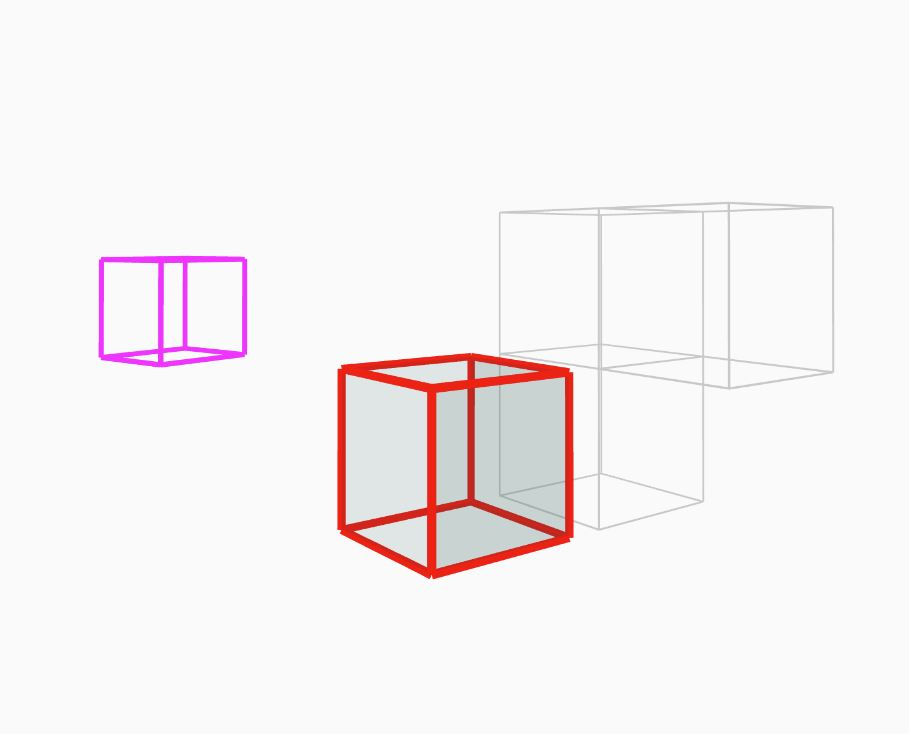

## T1Cube
就是个长方体
#### 一些特性
- [x] 可碰撞实体
- [ ] HUD显示检测区
- [x] 指定运动函数
- [x] 指定绘制方式[stroke,fill,strokeWeight]
#### 长啥样

#### 必须指定的值
|属性名|属性值|
|---|---|
|name|对象的名字|
|position|对象中心点x,y,z的位置|
|size|对象的大小|
#### 可以指定的值
|属性名|属性值|
|---|---|
|bump|碰撞盒大小|
|stroke|同Processing|
|fill|同Processing|
|strokeWeight|同Processing|
|rotation|对象旋转量|
|f|对象的动画函数|
#### 无法指定但是可以后台修改的值
暂无
#### 创建
```javascript
initCube(
    "cube1",
    {
        x:110,
        z:100,
        y:150,
    },
    {
        x:80,
        z:80,
        y:80,
    },
    {
        x:80,
        z:80,
        y:80,
    }
);    
```
```javascript
initCube(
    "cube2",
    {
        x:210,
        z:100,
        y:150,
    },
    {
        x:80,
        z:80,
        y:80,
    },
    null,
    [255,0,0],
    4,
    [120,220,210,20],
);    
```
```javascript
initCube(
    "cube4",
    {
        x:210,
        z:-300,
        y:150,
    },
    {
        x:80,
        z:80,
        y:80,
    },
    null,
    [255,0,255],
    4,
    null,
    {
        x:0,
        z:0,
        y:0,
    },
    (t,obj)=>{
        obj.position.y=sin(t/10)*10+190;
        obj.rotation.y+=0.001;
    },
);    
```
*vezzzing 2022.1.9 萧山 家*
*v3d asso : ivex ds*