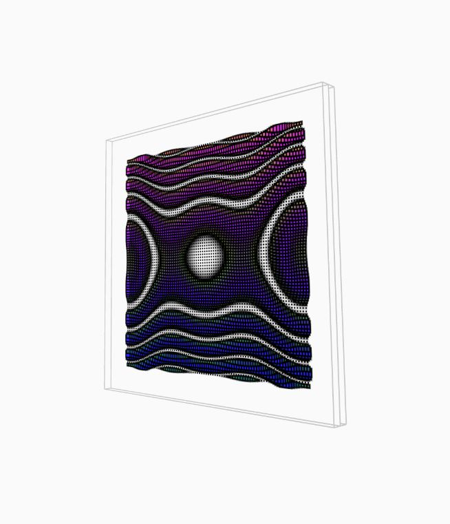

## T11BasicDisplayScreen
最常见的展示屏
#### 一些特性
- [x] 可碰撞实体
- [x] HUD显示检测区
- [ ] 指定运动函数
- [ ] 指定绘制方式[stroke,fill,strokeWeight]
#### 长啥样

#### 必须指定的值
|属性名|属性值|
|---|---|
|name|对象的名字，一个页面里的对象不能重名|
|position|对象中心点x,y,z的位置|
|heading|朝向：true朝向z轴,false朝向x轴|
|fuc|传入的函数对象，必须继承于TdFunction，就是屏幕上显示的内容以及HUD显示的内容|
#### 可以指定的值
|属性名|属性值|
|---|---|
|enterStroke|玩家进入HUD显示区时屏幕的描边颜色，传入null代表不改变|
#### 无法指定但是可以后台修改的值
|属性名|说明|属性值|
|---|---|---|
|stroke|同Processing|200|
|fill|同Processing|null|
|strokeWeight|同Processing|1|
|sw|宽度|300|
|sh|高度|300|
|sz|厚度|20|
|enterLen|前后方向上检测显示HUD的检测区宽度|300|
#### 创建
```javascript
initBasicDisplayScreen(
    "displayscreen4",
    {x:placeR,z:0,y:300},
    false,
    new TdFunctionFlat(
        {author:"vezzzing",date:"2022.1.7"},
        -5,5,80,
        -5,5,80,
        `sin(x*x+sin(y)*y+T)`,
        `
        stroke(0);
        fill(map(x,-5,5,0,255),map(z,-1,1,255,0),map(z,-1,1,0,255));
        rect(px,py,map(z,-1,1,0,5));`
    ),null
);
```
*vezzzing 2022.1.9 萧山 家*
*v3d asso : ivex ds*