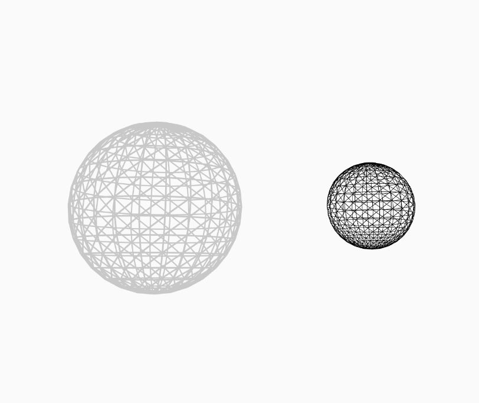

## T2Sphere
就是个球
#### 一些特性
- [ ] 可碰撞实体
- [ ] HUD显示检测区
- [x] 指定运动函数
- [x] 指定绘制方式[stroke,fill,strokeWeight]
#### 长啥样

#### 必须指定的值
|属性名|属性值|
|---|---|
|name|对象的名字|
|position|对象中心点x,y,z的位置|
|size|对象的大小|
#### 可以指定的值
|属性名|属性值|
|---|---|
|stroke|同Processing|
|strokeWeight|同Processing|
|fill|同Processing|
|rotation|对象旋转量|
|f|对象的动画函数|
|paraList|携带的参数列表|
#### 无法指定但是可以后台修改的值
暂无
#### TS规范
```typescript
/**
 * 生成基本的球体
 * @param {string} name 名称
 * @param {{x:number,y:number,z:number}} position 位置
 * @param {{r:number}} size 大小
 * @param {Array<number>|null} stroke P5-stroke值
 * @param {number} strokeWeight P5-strokeWeight值
 * @param {Array<number>|null} fill P5-fill值
 * @param {{x:number,y:number,z:number}|null} rotation 旋转量
 * @param {(t:number,obj:object)=>void|null} f 动效函数，obj是自身this
 * @param {{}} paraList 携带的参数列表
 */
```
#### 创建
```javascript
initSphere(
    "s1",
    {
        x:0,
        z:0,
        y:300,
    },
    {
        r:60,
    },
);
```
```javascript
initSphere(
    "s2",
    {
        x:0,
        z:100,
        y:300,
    },
    {
        r:30,
    },
    [0],
    0.3,
    null,
    {
        x:0,
        z:0,
        y:0,
    },
    (t,obj)=>{
        obj.position.x=sin(t/100)*150;
        obj.position.z=cos(t/100)*150;
        obj.rotation.y+=0.02;
    }
);
```
*vezzzing 2022*

*v3d asso : ivex ds*
<br>
<br>
