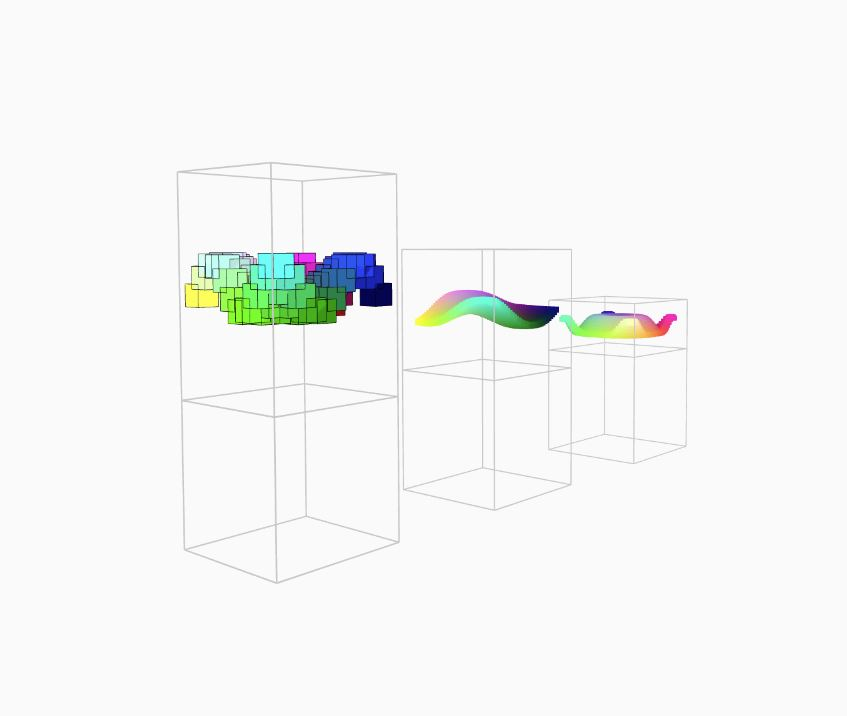

## T21BasicDisplayBox
最常见的展示柜子
#### 一些特性
- [x] 可碰撞实体
- [x] HUD显示检测区
- [ ] 指定运动函数
- [ ] 指定绘制方式[stroke,fill,strokeWeight]
#### 长啥样

#### 必须指定的值
|属性名|属性值|
|---|---|
|name|对象的名字，一个页面里的对象不能重名|
|position|对象中心点x,y,z的位置|
|fuc|传入的函数对象，必须继承于GlFunction，就是屏幕上显示的内容以及HUD显示的内容|
|sizeBase|底座大小|
|sizeBox|展示盒大小|
#### 可以指定的值
|属性名|属性值|
|---|---|
|enterStroke|玩家进入HUD显示区时屏幕的描边颜色，传入null代表不改变|
#### 无法指定但是可以后台修改的值
|属性名|说明|属性值|
|---|---|---|
|stroke|同Processing|200|
|fill|同Processing|null|
|strokeWeight|同Processing|1|
|enterR|HUD检测区半径|330|
#### 创建
```javascript
initBasicDisplayBox(
    "displayBox1",
    {x:0,z:1000,y:100},
    new GlTdFunction(
        {author:"vezzzing",date:"2022.1.7"},
        -2,2,30,
        -2,2,30,
        `sin(x*y+T)`,
        `
        strokeWeight(0.3);
        stroke(0);
        fill(map(x,-2,2,0,255),map(y,-2,2,0,255),map(z,-1,1,0,255));
        box(5);`
    ),
    {x:100,z:100,y:100},
    {x:100,z:100,y:100}
);
```
*vezzzing 2022.1.9 萧山 家*
*v3d asso : ivex ds*